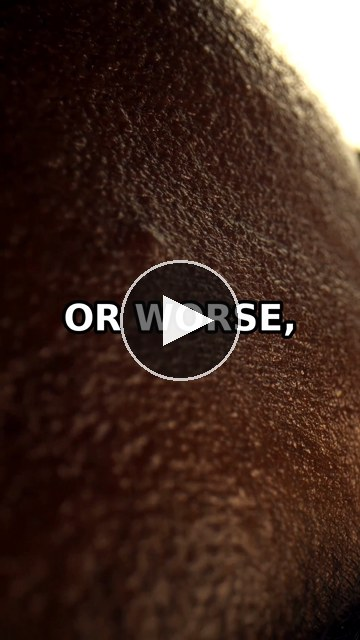
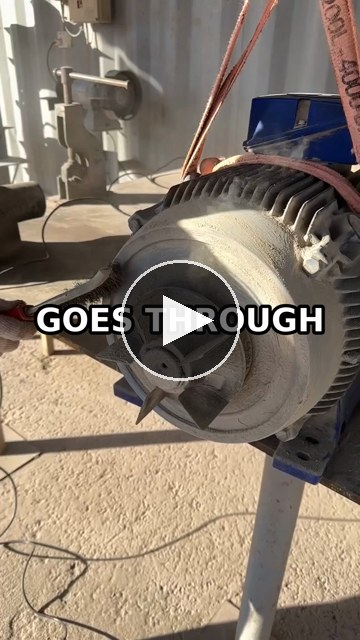
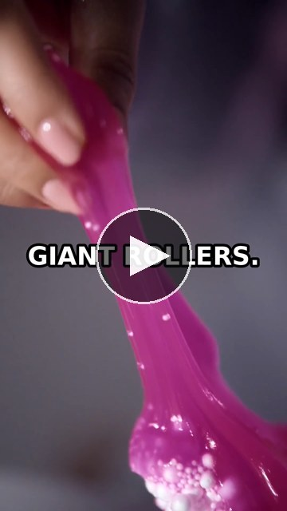

<div align="center">
  <a href="https://github.com/Icey-Python/memeforge">
    
  </a>
  <h1>memeforge</h1>
  <p>
    <strong>AI vertical video generator</strong><br />
    Topic in, Short out: LLM script, natural voiceover, kinetic captions, full-screen background.
  </p>
  <p>
    <a href="#quickstart"></a>
    <a href="#quickstart"></a>
    <a href="#docker"></a>
    
  </p>
  <p>
    
    
    
    
  </p>
</div>

AI vertical video generator. Turn a topic — or your own pasted script —
into a vertical 1080×1920 short-form video: full-screen background
loop, an optional hook headline or quote card, kinetic captions, free
voiceover. Built for YouTube Shorts, TikTok, and Reels pacing.

## Made with memeforge

| [](assets/demo/sample-1.mp4) | [](assets/demo/sample-2.mp4) | [](assets/demo/sample-3.mp4) |
| :---: | :---: | :---: |
| Sample 1 · 0:29 | Sample 2 · 0:34 | Sample 3 · 0:29 |

Click a card to watch the full 1080×1920 render. All three were
generated end-to-end by the pipeline: LLM script, TTS voiceover,
kinetic captions, background loop.

## Monorepo layout

| Path | What |
| --- | --- |
| `web/` | Next.js 16 App Router studio — React Flow canvas with modular nodes (Model Connector → Topic → Script → Voiceover → Preview, plus Gameplay), dark sleek UI |
| `server/` | FastAPI backend — LLM script generation (OpenAI-compatible / Ollama / mock), TTS (edge-tts free default, Meme Classic with Brian & the iconic meme voices, TikTok with auto-fallback, Google Translate, Fish Audio with SSE word timestamps, Azure, ElevenLabs), async ffmpeg render jobs |

## Quickstart

```bash
# 1. Backend (http://localhost:8000)
cd server
python3.11 -m venv .venv && .venv/bin/pip install -r requirements.txt
cp .env.example .env
.venv/bin/uvicorn app.main:app --reload --port 8000

# 2. Frontend (http://localhost:3000)
cd web
pnpm install
cp .env.example .env
pnpm dev
```

Or run both at once: `./scripts/dev.sh`.

### Docker

The whole stack runs in containers — no local Python/Node/pnpm needed:

```bash
docker compose up --build                     # production build (server :8000, web :3000)
docker compose -f docker-compose.dev.yml up --build   # hot-reload dev stack
```

- **server** — multi-stage image (`server/Dockerfile`, Python 3.11-slim) with
  `ffmpeg`/`ffprobe` and the DejaVu caption fallback font baked in. Rendered
  videos persist in the `memeforge_outputs` named volume; background clips
  dropped into `server/assets/gameplay/` and SFX into `server/assets/sfx/` on
  the host are visible to the container via read-only bind mounts. Server-side
  API keys: copy `server/.env.example` to `server/.env` (compose loads it
  automatically) or export them before `docker compose up`.
- **web** — multi-stage Next.js image (`web/Dockerfile`) using the standalone
  server output. `NEXT_PUBLIC_SERVER_URL` is baked at build time (defaults to
  `http://localhost:8000`, the URL the browser uses); override with
  `NEXT_PUBLIC_SERVER_URL=https://api.example.com docker compose build web`.
- **dev stack** — sources are bind-mounted (`./server` → `/app`, `./web` → `/app`),
  uvicorn runs `--reload` and web runs `next dev`; container-native
  `node_modules` and `.next` live in named volumes. After changing
  `web/package.json`, refresh them with
  `docker compose -f docker-compose.dev.yml run --rm web pnpm install --ignore-scripts`. If
  hot reload misses host edits, set `WATCHFILES_FORCE_POLLING=1` before `up`.
- Healthchecks gate startup (`GET /health` for the server, `GET /` for web).
  Verify ffmpeg inside the container with `docker compose exec server ffmpeg -version`.

Zero-config demo: the default **Mock** LLM provider works offline, and
**edge-tts** needs no API key — the whole topic → script → voiceover →
render pipeline runs without any credentials. The **Meme Classic**
provider (Brian, Justin, Matthew — the iconic Twitch meme voices) and
**Google Translate TTS** are free and keyless too; the legacy **TikTok
meme voices** provider falls back to edge-tts / Brian automatically
when its unofficial endpoints reject anonymous calls.

### Background clips

Render requires a background: either a gameplay loop or auto-selected
stock clips. Drop `<id>.mp4` files into `server/assets/gameplay/`
(e.g. `minecraft-parkour.mp4`) — the studio's Gameplay node flips to
`CLIP READY` automatically. Long clips (5+ min) get a random seek
in-point per render so repeated renders surface fresh footage. Optional
punchline SFX goes in `server/assets/sfx/`.
`server/scripts/fetch-gameplay.sh` can pull public-domain clips.

## The studio pipeline

1. **Model Connector** — pick an LLM provider + model (live model discovery from
   Ollama / OpenAI-compatible endpoints; mock works offline)
2. **Topic / Prompt** — topic, tone, target duration (30/60/90s) → *Generate
   script*; or switch the Script node to **Custom** and paste your own script
3. **Script** — generated or pasted; every line editable, reorderable, and
   removable, with live word count + spoken-length estimate. The 60s default
   targets ~140 words (~2.3 words/sec), the sweet spot for Shorts/TikTok/Reels
4. **Voiceover / TTS** — one searchable voice catalog across all seven engines
   (including live Fish Audio marketplace search) with inline per-voice
   previews; free by default (Meme Classic Brian & friends, edge-tts)
5. **Gameplay / Background** — pick a gameplay loop, or let the Stock tab
   auto-select a keyword-driven clip sequence for the script (fast-cut
   montage optional)
6. **Preview & Export** — readiness checklist, top-card style (hook / quote /
   clean), render → inline player

## API (v1)

| Endpoint | Purpose |
| --- | --- |
| `GET /health` | liveness + ffmpeg/edge-tts capability probe |
| `GET /api/v1/models` | available LLM providers |
| `POST /api/v1/models/discover` | live model list for a provider (Ollama `/api/tags`, OpenAI-compatible `/v1/models`) |
| `POST /api/v1/generate-script` | topic + duration target → short-form script (mock/openai-compatible/ollama) |
| `GET /api/v1/voices?provider=edge` | TTS voice catalog (`edge\|meme_classic\|tiktok\|google\|fish_audio\|azure\|elevenlabs`) |
| `POST /api/v1/tts` | synthesize one line → audio url |
| `GET /api/v1/stock/search` | Pexels / Pixabay portrait clip search |
| `POST /api/v1/stock/auto-select` | keyword round-robin clip sequence for the script |
| `GET /api/v1/render/gameplays` | background clip catalog + availability |
| `POST /api/v1/render` | queue a render job (async; `card_style`: hook/quote/none) |
| `GET /api/v1/render/{job_id}` | poll job progress → `video_url` |

Interactive docs: http://localhost:8000/docs.

## Architecture notes

- **Render pipeline** — per-line TTS → duration probing (ffprobe) → caption
  timeline → Pillow caption PNGs + optional brand hook card (orange M tile,
  Memeforge header row, hookline body; fades out after the hook) → ffmpeg
  full-screen `overlay` compositor (background fills the whole 1080×1920
  frame; the card floats upper-center; long clips start at a random seek) →
  H.264. Kinetic captions auto-fit inside a centered 900px safe zone with
  font scaling, so no word ever clips the frame edge. Captions deliberately
  avoid ffmpeg's optional `drawtext` filter (absent from Homebrew builds) —
  works on any ffmpeg.
- **Voice sync** — line durations always come from probed audio, never
  estimates. edge-tts word boundaries and Fish Audio's SSE stream
  (`/v1/tts/stream/with-timestamp`, per-chunk word timestamps) drive per-word
  caption timing; other engines fall back to even word spacing.
- **Duration pacing** — script generation takes a `duration_target`
  (default 60s). Word budgets use ~2.2–2.5 words/sec of speech (60s ≈
  130–150 words) and line counts ~4s of speech per line.
- **Resilience** — per-line TTS timeout + retries, ffmpeg/ffprobe subprocess
  timeouts, in-memory job store with progress polling.
- **CORS** — any `localhost`/`127.0.0.1` origin allowed in dev; set
  `MEMEFORGE_CORS_ORIGINS` for production.
